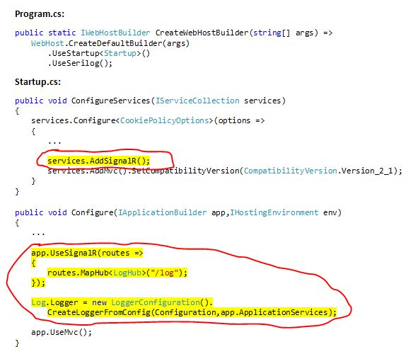
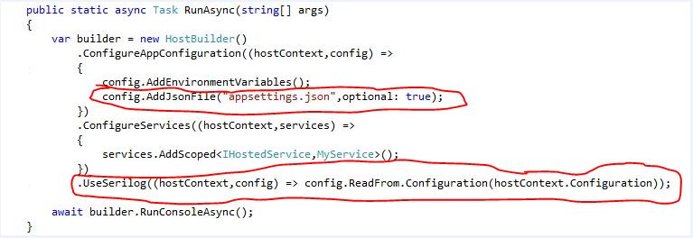
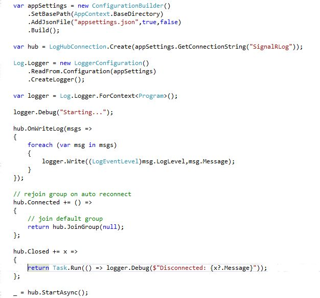
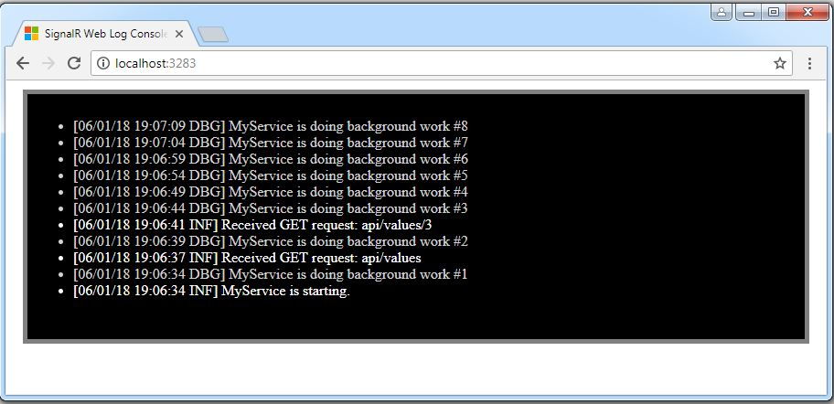
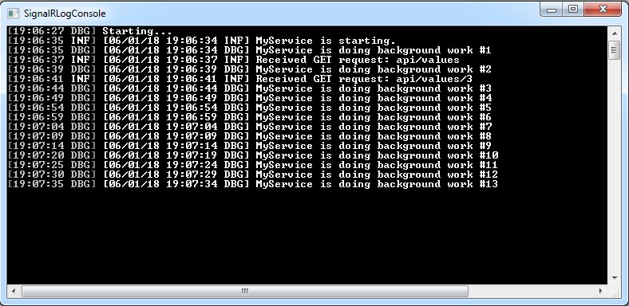

# Serilog.Sinks.SignalR.NetCore
A Serilog sink that distributes events to SignalR Log Clients (ASP.NET Core)

Inspired by serilog-sinks-signalr: https://github.com/serilog/serilog-sinks-signalr

See the sample projects for details.

**SignalR Hub application:**

**SignalR Log Publisher:**

**SignalR .NET Client Logger:**

**Web Log Console output:**

**.NET Core Log Console output:**

